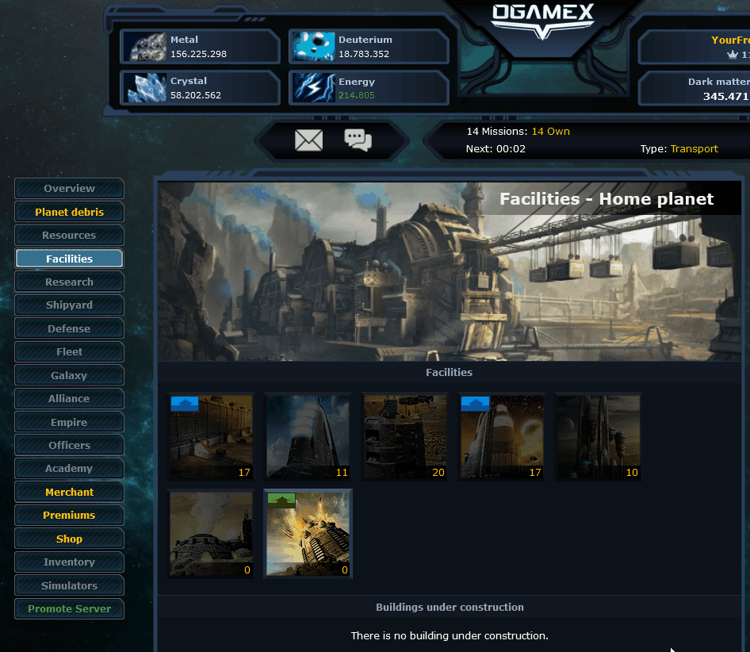
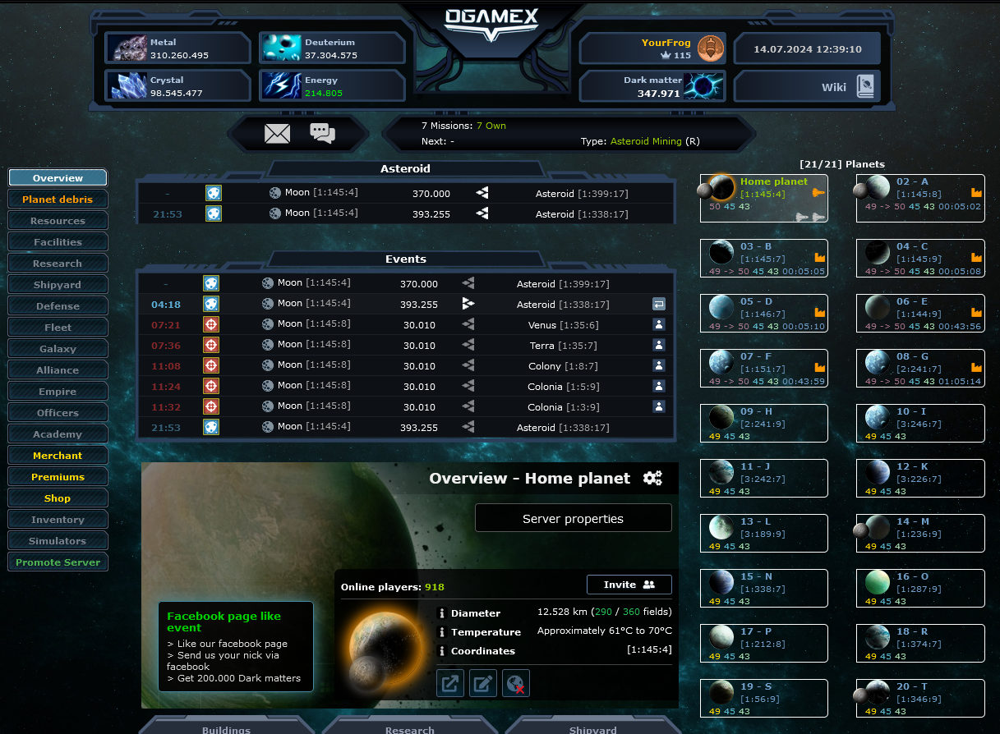
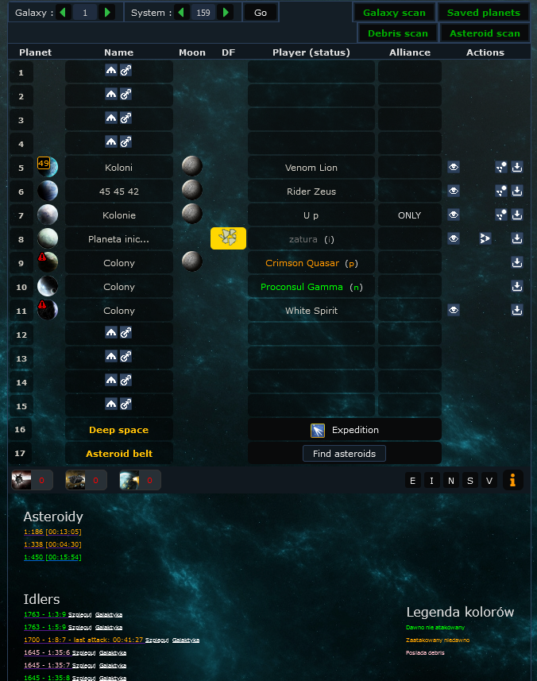

Zbiór prostych skryptów do greasmonkey do gry ogamex.net

### Aktualna wersja:
https://github.com/YourFrog/OGameX/releases/tag/v0.0.1-alpha.1

### Jak zainstalować?
Wkrótce...

### Informacje ogólne:
- Nie odpowiadam za ewentualne bany
- Jeżeli posiadasz sugestie / znalazłeś błąd nie krępuj się napisz mi o tym na discord!
- Skrypt działa tylko na hyper (można to zmienić w nagłówkach skryptów)
- Błędy zgłaszaj proszę przez zakładkę issue
   
### Kompatybilność:
- Desktop Firefox
- Desktop Google Chrome
- Android Google Chrome
- Inne? Nie sprawdzaliśmy

### Wysyłka surowców

### Layout:

### Galaktyka:

